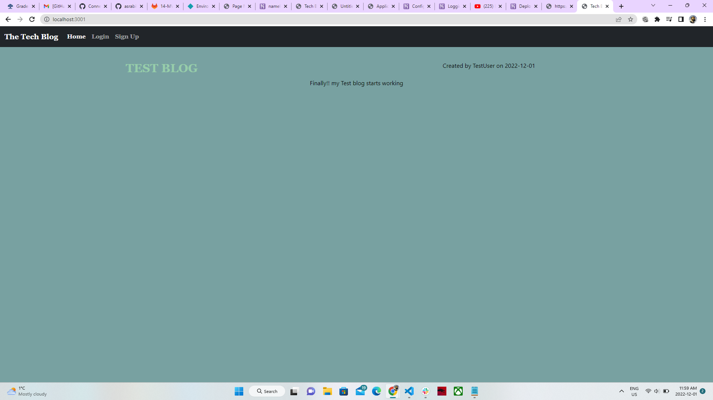
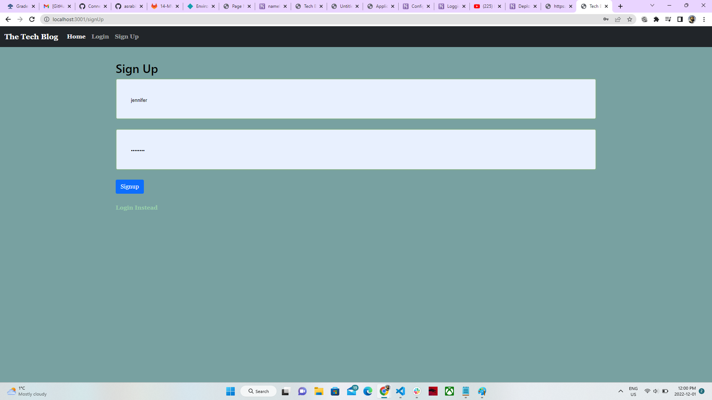
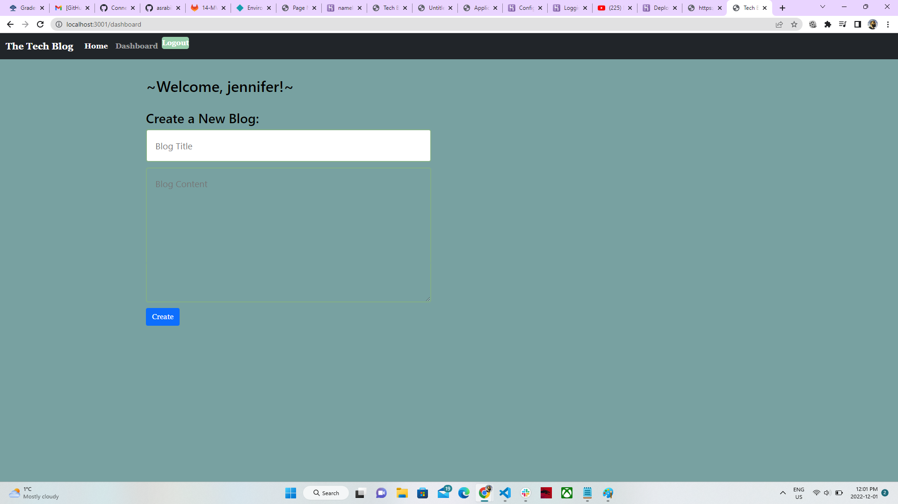
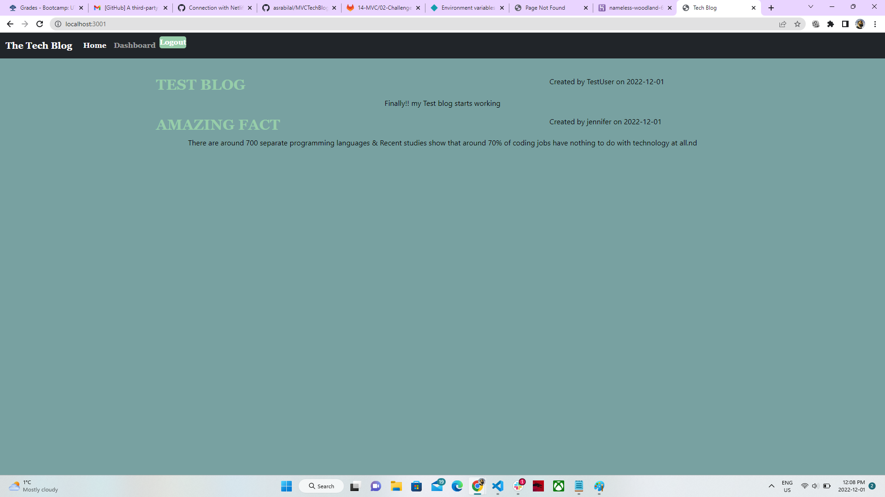

# 14 Model View Controller (MVC): Tech Blog

It is a CMS-style blog site similar to a Wordpress site, where developers can publish their blog posts and comment on other developers’ posts as well. we build this site completely from scratch and deploy it to Heroku. Our app follows the MVC paradigm in its architectural structure, using Handlebars.js as the templating language, Sequelize as the ORM, and the express-session npm package for authentication.

## Licensing:
  
  
  ## Table of Contents 
  - [Description](#description)
  - [Installation](#installation)
  - [Usage](#usage)
  - [License](#License)
  - [Contribution](#contribution)
  - [Testing](#testing)
  - [Questions](#questions)
  - [Video](#Walk-throughVideoLink)
  - [Additional Info](#additional-info)
 
  ## Description:
  This app utilizes many different files, database storage, and technologies to create a Tech blog. A user can view any blogs on the main page and click them to see     the comments. Both the post and comments will show who posted them and date.

  If a user would like to create their own blog they can sign up to create an account or login to an existing one. Once logged in they now have access to a dashboard     for posting blogs. They can also go to other blogs and comment on them leaving their name and a date.

  The user then can logout and end their session or a timeout exists on the session as well.
  
  ## Installation:
  This application requires Node.js, Express.js, and Sequelize.
  To connect to the database:

   - run mysql -u root -p and enter password from .env file.
   - Then source the schema.sql.
   - To seed the file run npm run seed.
   - Finally to connect to the server run node server.js.
   
  ## Usage:
  The app allows the user to view, add, edit, and delete blogs.
  
  ## License:
  MIT
  
  ## Contribution:
  If you feel the need to contribute to this project, feel free to leave feedback in the Github repository, which will be linked below.
  
  ## Testing:
  Testing not required.
  
  ## Questions:
  [HERE](https://github.com/asrabilal)
  
  ## Screenshots:
    
    
    
    
   
  
  ## Video
  [Walk-through Video Link](https://drive.google.com/file/d/1Zwk5yb9txinbWb6OOUT5hFFa8eUQjEYw/view) 

  ## Additional Info:
  - Github: [asrabilal](https://github.com/asrabilal)
  - Email: asra596@gmail.com 

© 2022 Trilogy Education Services, LLC, a 2U, Inc. brand. Confidential and Proprietary. All Rights Reserved.
